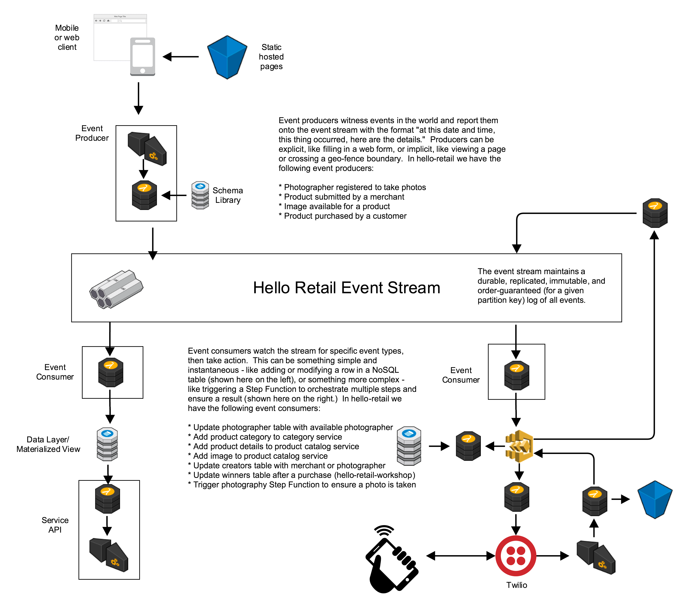
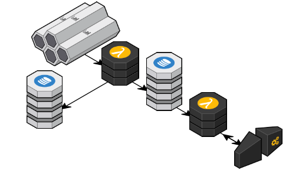

# Serverless Retail Workshop.

This GitHub repository is an open-source workshop intended to accompany the core functional code in https://github.com/smartbiz/serverless-retail. For the workshop portion, participants take part in an interactive exercise playing the roles of merchants, photographers, and customers using serverless-retail core.  After that, you extend it using this workshop to calculate the winning photographer and merchant.  Perhaps, afterwards, you can extend it in even more interesting ways for extra credit!

Serverless Retail is a 100% Serverless, Event-Driven Framework and Functions As A Service (FaaS) Proof-Of-Concept showcasing a central unified log approach as applied to the retail problem space. All code and patterns are intended to be re-usable for scalable applications large and small.

Using Microservices to create smaller, cohesive services. When these microservices need to interact, services call the API of another service. But this approach creates code and operational dependencies between microservices.

Code dependencies created by calling other services creates complexity. The caller has to know which dependent services to call and how to call them. This becomes complex to manage in code as the number of dependencies grows.

Operational dependencies between services can affect performance and availability of the application. Services that are dependent on an API depend on the performance that API. Increased latencies or failures in one service will impact other services.

The solution to these problems is to reverse these dependencies by using Events. Creating services that produce and consume events allows you to decouple them.
Event Sourcing is a well understood solution to this problem. But applying this solution to a completely Serverless Application is NEW.

**Modern Agile** (Make People Awesome, Deliver Value Continuously, Make Safety a Prerequisite, Experiment and Learn Rapidly) is easier with Serverless, since Developers no longer have to solve problems that have been solved a million times before, by many other Developers (how to do authentication, how to scale, etc…) and allows them to focus on delivering Customer Value. Time to go to production can now be measured in hours, not days or weeks.

## Serverless Retail! core explained - an event-centric, serverless architecture

## Technologies used for this workshop
* **AWS Lambda** One way of thinking about it is 'functions as a service.'
* **AWS Kinesis** The stream.  Technically a durable replicated log.
* **AWS API Gateway** A fully-managed web-service front-end.  Resources, methods, authentication.  Trigger lambdas to do the work.
* **AWS DynamoDB** NoSQL tables.  Used here as a simple key-value store.
* **Serverless.com Framework** is an open source project with lots of handy tools to manage serverless configurations, shared code, and deploy your work to AWS.

## Why?
Serverless architectures offer incredible promise to reduce code complexity, operations costs, improve scalability, and when used correctly, security.  When you go serverless, you quickly realize the power of event-driven architectures.  These architectures are impedance matched with stateless, event-driven AWS Lambda functions and AWS Step Functions fully managed state machines.  A complete systems architecture that takes advantage of a unified central log/stream has benefits to extensibility, simplicity, backup and restore, and databases-as-cattle.  This project attempts to explore and prove out some of these concepts in a production-ready and scalable format.

## What you'll build in this workshop

In this diagram we see a lambda consuming from the stream and populating two DynamoDB tables.  The first keeps track of which merchants and photographers are associated with which products.  The second table maintains a tally of sales per merchant and sales per photographer.  The web service that is exposed through API Gateway invokes a lambda that reads from this aggregated view.

## What does all of this cost?
* AWS Lambda charges based on both the number of invocations and the duration of each function. For simple functions like these, assume about $.20 per million invocations.
* AWS API Gateway is about $3.50 per million calls.
* AWS DynamoDB for up to 5TPS in this example should cost less than $4 a month.

So, if we had 10,000,000 events a day (~200 events per second peak) and 1,000 reads from the web service, we'd expect about $2 in Lambda, $.0035 in API Gateway, and $10 a day in DynamoDB.

> **_Notes:_**
>
> According to our limited resources, we just support NodeJS in Mac OS and Ubuntu 16.04 LTS.

## Action Items

- [x] Lesson0: Node.js
- [x] Lesson0: AWS-CLI & AWS Credentials
- [x] Photographer Registration
- [x] Product Creation: New Product + New Photo
- [x] Failure Handling
- [x] Replay and Log persistence
- [x] Securing Events

